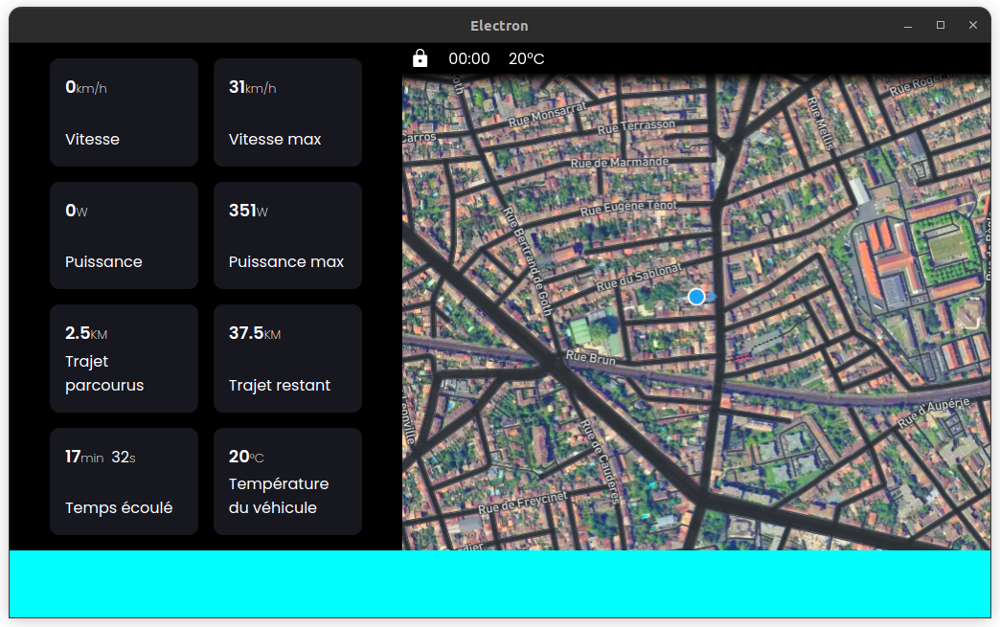
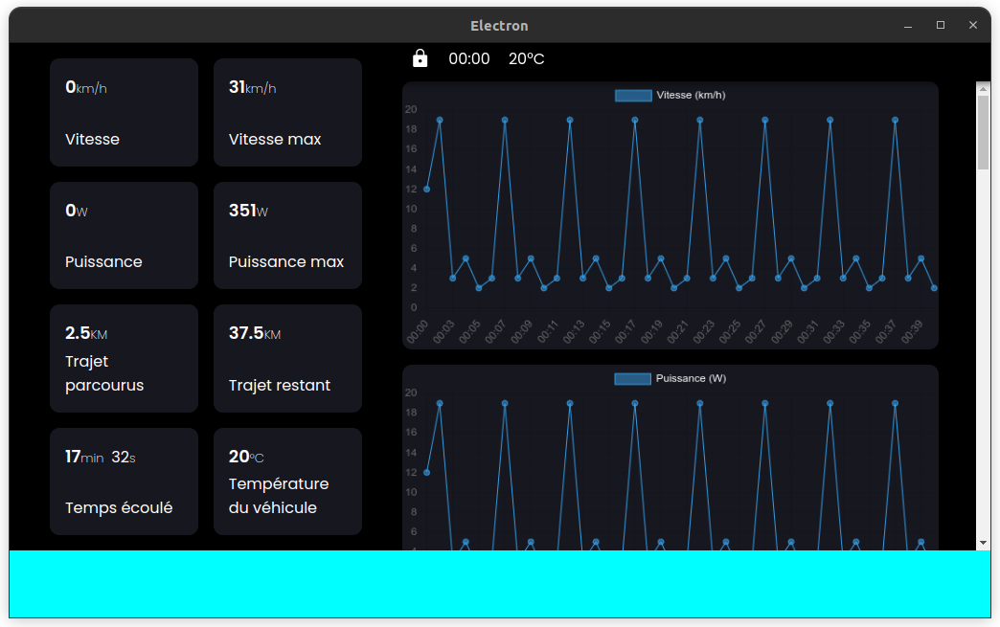

# Projet E-Motion

E-Motion est un projet ambitieux visant à concevoir un buggy électrique sur mesure, intégrant des technologies de pointe. Conçu pour offrir une expérience de conduite électrique innovante et écologique, le buggy E-Motion combine technologies de pointe, performances et design élégant.

## Objectif

L'objectif principal du projet E-Motion est de concevoir et de construire un buggy électrique à deux places, capable de rouler sur les pistes cyclables de campagne tout en offrant une expérience de conduite dynamique et sécurisée. Le buggy sera équipé de technologies avancées pour améliorer la sécurité, la connectivité et le confort du conducteur et du passager.

## Principales Caractéristiques

- **Motorisation Électrique :** Le buggy sera propulsé par un système de motorisation électrique, offrant une conduite fluide, silencieuse et respectueuse de l'environnement.

- **Tableau de Bord High-Tech :** Un écran tactile interactif affichera des informations essentielles comme la vitesse, l’autonomie et la navigation.

- **Système de Surveillance :** Des capteurs intégrés surveilleront en temps réel les performances du véhicule, y compris l'état de la batterie, la température, et d'autres paramètres essentiels.

- **Connectivité Avancée :** Le buggy sera équipé d'une connectivité Bluetooth pour la diffusion de musique, les appels mains libres, et la communication avec d'autres appareils mobiles.

- **Sécurité Renforcée :** Des fonctionnalités de sécurité avancées, telles que la détection des obstacles, les systèmes d'alerte et les freins antiblocage, seront intégrées pour assurer une conduite sûre en toutes circonstances.

## Composants Clés

Le projet E-Motion utilisera une variété de composants clés, notamment :

- **Châssis de Buggy :** Un châssis solide et léger fournira la base structurelle du véhicule.

- **Système de Propulsion Électrique :** Un ensemble de moteurs électriques et de batteries lithium-ion assurera la propulsion du buggy.

- **Jetson Nano :** Une carte informatique puissante, comme le Jetson Nano, servira de cerveau central pour contrôler les systèmes du véhicule et gérer les fonctionnalités high-tech.

- **Caméras et Capteurs :** Des caméras et des capteurs seront utilisés pour la détection des obstacles, la surveillance de l'environnement, et d'autres applications.

## Intérieur du Véhicule

En plus des fonctionnalités extérieures, l'intérieur du véhicule comprendra également :

- **Ports USB C :** Des ports USB C seront intégrés pour recharger les appareils électroniques, offrant une commodité supplémentaire pour le passager.

- **Capteur de Distance à Ultrason :** Un capteur de distance à ultrason sera installé à l'arrière du véhicule pour détecter la distance par rapport aux obstacles lors de la marche arrière.

- **Connectivité WiFi :** Une connectivité WiFi sera disponible pour fournir des informations de charge, de température et un accès aux caméras lorsque le véhicule est stationné à domicile.

- **Amplificateur Stéréo :** Le Jetson Nano sera connecté à un amplificateur stéréo pour une expérience sonore de qualité dans le véhicule.

- **Micro de Qualité :** Un micro de qualité sera installé pour les appels téléphoniques mains libres et autres fonctions de communication.

## Connecteurs à l'Arrière du Véhicule

À l'arrière du véhicule, deux connecteurs étanches seront disponibles pour ajouter une remorque :
- Le premier connecteur sera dédié à la communication entre la remorque et le véhicule, permettant l'échange de données entre les capteurs de la remorque et la gestion des actionneurs du véhicule à la remorque.
- Le deuxième connecteur servira à alimenter le véhicule en énergie solaire ou avec une batterie externe, si la remorque en possède.

## Dashboard Electron JS

Le dashboard est un élément essentiel du projet E-Motion. Il s'agit d'un écran de 16 pouces d'une résolution de 1024x600 pixels, conçu pour offrir une interface utilisateur intuitive et informative pour les utilisateurs du buggy électrique.

### Caractéristiques du Dashboard :

- **Taille de l'écran** : 16 pouces
- **Résolution** : 1024x600 pixels
- **Technologie** : Connecté au Jetson Nano via le PCB800099
- **Framework Utilisé** : Electron JS

### Fonctionnalités Principales :

1. **Affichage des Informations du Buggy** : Le dashboard affiche en temps réel des informations vitales sur le buggy électrique, telles que la vitesse, la température du moteur, le niveau de batterie, etc.

2. **Contrôle et Gestion** : Il permet aux utilisateurs d'interagir avec le buggy, en contrôlant diverses fonctions telles que les feux, les clignotants, etc., ainsi qu'en accédant à des paramètres de configuration.

3. **Navigation Intuitive** : L'interface utilisateur est conçue pour être conviviale et intuitive, offrant une navigation fluide entre les différentes fonctionnalités et écrans du dashboard.

### Aperçu :



Les images ci-dessus donnent un aperçu visuel du dashboard Electron JS. Avec son design moderne et ses fonctionnalités avancées, le dashboard améliore l'expérience de conduite et offre un contrôle total sur le buggy électrique.

### Mode test et développement :
Afin de tester les différents composants du véhicule, une interface est mise à disposition simulant la connexion avec les éléments de celui-ci permettant d'avoir un accès facile au débogage


L'image ci-dessus donne un aperçu visuel de l'interface du mode test et développement Electron JS. Avec ses fonctionnalités avancées, le mode test et développement améliore l'expérience de débogage et offre un contrôle total sur la communication avec buggy électrique.

### Dépendances :
L'application possède plusieurs dépendances dont `Node JS`, `libbluetooth-dev`, etc. Pour les installer, executez le fichier `dashboard/install.sh`.

L'application nécessite des tokens placés dans un fichier nommé `dashboard/src/database.json`. Le contenu du fichier se présente ainsi:
```json
{
    "mapbox-token": "...",          //token de mapbox (50 000 req/mois)
    "spotify-refresh-token": "...", //refresh token de l'utilisateur spotify
    "spotify-secret": "..."         //id secret de l'app spotify
}
```

## Carte de l'agencement des composants


## License

Le projet E-Motion est sous licence Creative Commons (CC BY-NC-ND 4.0), à l’exception du dossier 'chassis'. En téléchargeant ce dépôt, vous acceptez les termes de cette licence pour tous les éléments du projet, sauf ceux spécifiquement exclus dans le dossier "chassis". Le projet peut être partagé et utilisé à des fins non commerciales, avec mention de l’auteur et sans modification, sauf pour le dossier 'chassis'. Pour plus d'informations sur cette licence, veuillez consulter le fichier `LICENSE` à la racine du dépôt.


## Conclusion

Le projet E-Motion vise à repousser les limites de la mobilité électrique en créant un buggy électrique innovant et futuriste, équipé des dernières technologies et conçu pour répondre aux besoins des conducteurs modernes. Suivez notre progression alors que nous travaillons à réaliser notre vision d'un avenir plus propre, plus sûre et plus connecté pour la conduite électrique.

## Soutenir le Projet

Le projet E-Motion est une initiative passionnée et indépendante visant à repousser les limites de la mobilité électrique. Si vous appréciez ce projet et souhaitez contribuer à son développement, vous pouvez apporter un soutien financier.

Chaque contribution aide à financer les composants, le matériel et les améliorations nécessaires pour faire avancer E-Motion.

🔗 Faire un don : [paypal.me/HydixFR](https://paypal.me/HydixFR?country.x=FR&locale.x=fr_FR)

Merci pour votre soutien ! 💙🚀