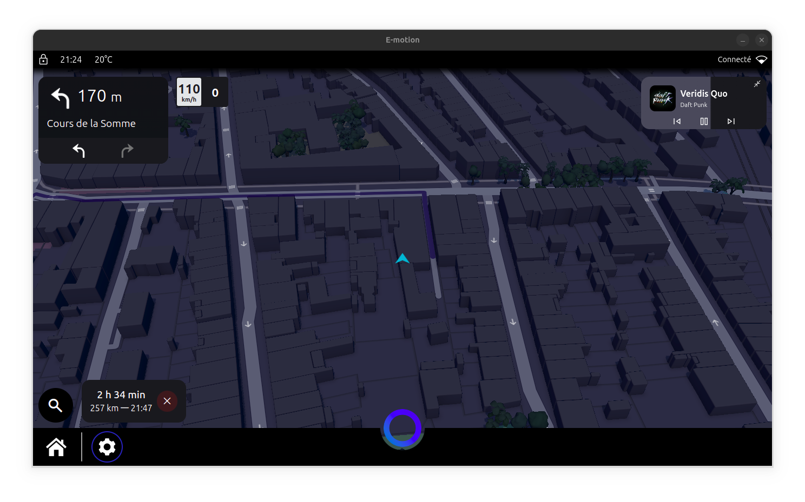
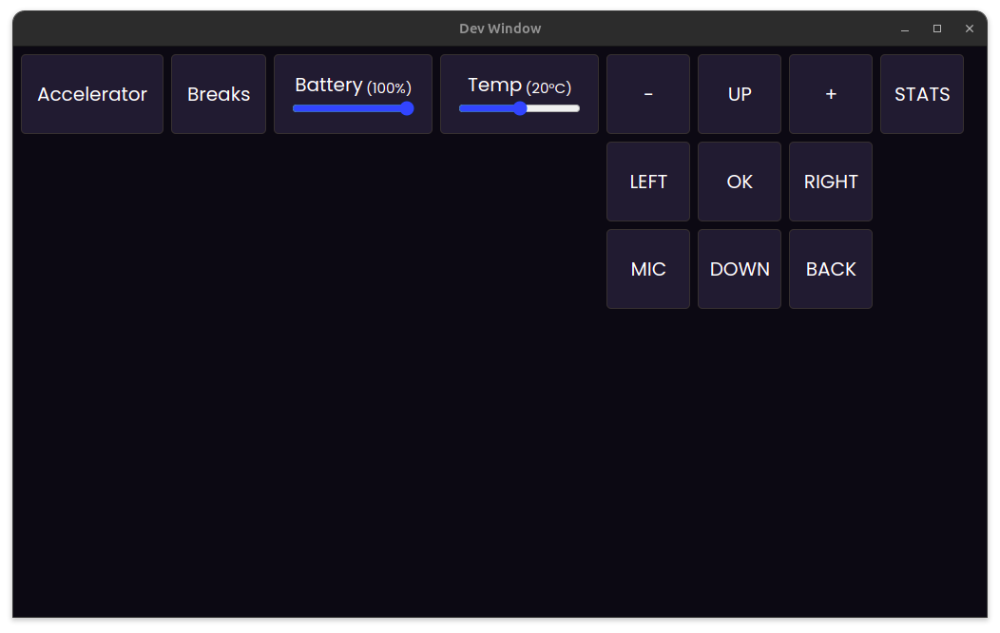

# E-Motion Project

E-Motion is an ambitious project aimed at designing a custom dashboard that integrates cutting-edge technologies. Built to deliver an enjoyable and innovative driving experience, the E-Motion dashboard combines advanced tech, performance, and sleek design.

## Objective

The primary goal of the E-Motion project is to create a dynamic and safe driving experience. The dashboard will be equipped with advanced technologies to enhance safety, connectivity, and comfort for both the driver and passengers.

## Key Features

* **High-Performance Services:** The dashboard leverages well-known, high-performance services such as Electron for software development, Waze for user alerts, Mapbox for dynamic and modern map rendering, and Spotify for music playback and passenger access to playlists.
* **15″ Touchscreen:** The software is currently designed for a 15″ touch display.
* **Monitoring System:** Integrated sensors will monitor driving in real time with both interior and exterior dashcams, as well as a rear-view camera.
* **Advanced Connectivity:** The vehicle will feature Bluetooth and Internet connectivity for music streaming (Spotify or local), hands-free calling, and communication with other mobile devices.
* **CAN Bus Access:** The dashboard will connect to the vehicle’s OBD-II port (on-board diagnostics) for direct access to vehicle information such as speed, fuel level, door status, etc.

## Core Components

The E-Motion project will use a variety of key components, including:

* **Jetson Nano:** A powerful compute board like the Jetson Nano will serve as the main computer to render the dashboard smoothly.
* **Cameras & Sensors:** Cameras and sensors will be used for obstacle detection, environmental monitoring, and additional applications.

## Vehicle Interior

In addition to software functionality, the vehicle’s interior will include:

* **USB-C Ports:** Integrated USB-C ports for charging electronic devices, offering extra convenience for passengers.
* **Ultrasonic Distance Sensor:** A rear-mounted ultrasonic sensor will detect distance to obstacles during reverse maneuvers.
* **Wi-Fi Connectivity:** Wi-Fi access for features such as camera feeds when the vehicle is parked and real-time vehicle location.
* **Stereo Amplifier:** The Jetson Nano will connect to a stereo amplifier for high-quality in-vehicle audio.
* **High-Quality Microphone:** A quality microphone will be installed for hands-free calls and other communication functions.

### Dashboard Specifications

* **Screen Size:** 15 inches
* **Resolution:** 1366×768 pixels
* **Frameworks Used:** Electron JS, Waze, Spotify, Mapbox, Google TTS, Google Maps, Chart.js, Wit.AI, etc.

### Main Functionalities

1. **Voice AI:** An AI powered by Wit.AI enables easy place searches and music control.
2. **Vehicle Data Display:** The dashboard shows vital vehicle information—speed, engine temperature, fuel level, etc.—in real time.
3. **Controls & Management:** Users can interact with various apps such as Spotify, YouTube, Camera, and more.
4. **Intuitive Navigation:** The user interface is designed to be friendly and intuitive, providing smooth navigation.

### Previews




### Test & Development Mode

To test the vehicle’s different components, an interface simulates connections to those elements, facilitating easy debugging.



### Dependencies

The application has several dependencies, including `Node.js`, `libbluetooth-dev`, etc. To install them, run:

```bash
./install.sh
```

### Running Tests

Simple unit tests are provided using **Jest** to verify some utility functions. To run them:

```bash
npm run test
```

## License

The E-Motion project is licensed under Creative Commons (CC BY-NC-ND 4.0). By downloading this repository, you agree to the terms of this license for all project materials. The project can be shared and used for non-commercial purposes with credit to the author and no modifications. For more details, please see the `LICENSE` file at the root of the repository.

## Conclusion

The E-Motion project aims to push the boundaries of mobility by creating an innovative, futuristic interface equipped with the latest technologies, designed to meet the needs of modern drivers. Follow our progress as we work toward a cleaner, safer, and more connected driving future.

## Support the Project

E-Motion is an independent, passion-driven initiative to push mobility forward. If you enjoy this project and want to contribute, you can offer financial support.

Each contribution helps fund components, hardware, and improvements necessary to advance E-Motion.

🔗 Make a donation: [paypal.me/HydixFR](https://paypal.me/HydixFR?country.x=FR&locale.x=fr_FR)

Thank you for your support! 💙🚀
