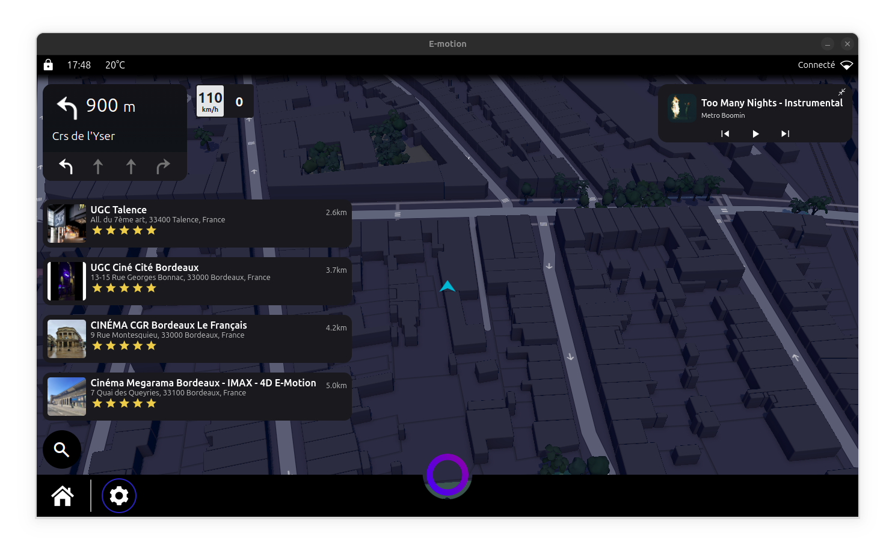
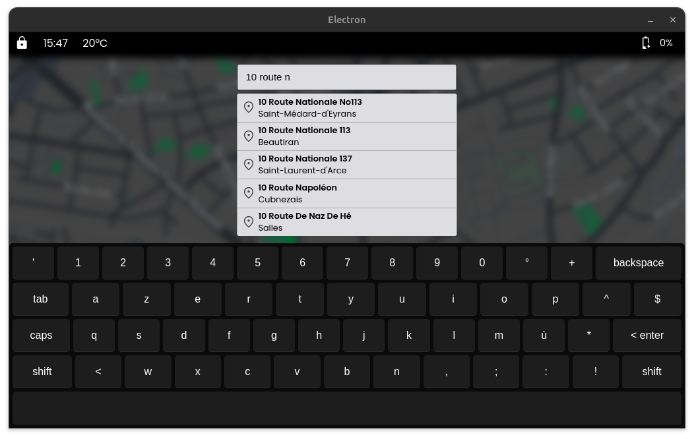
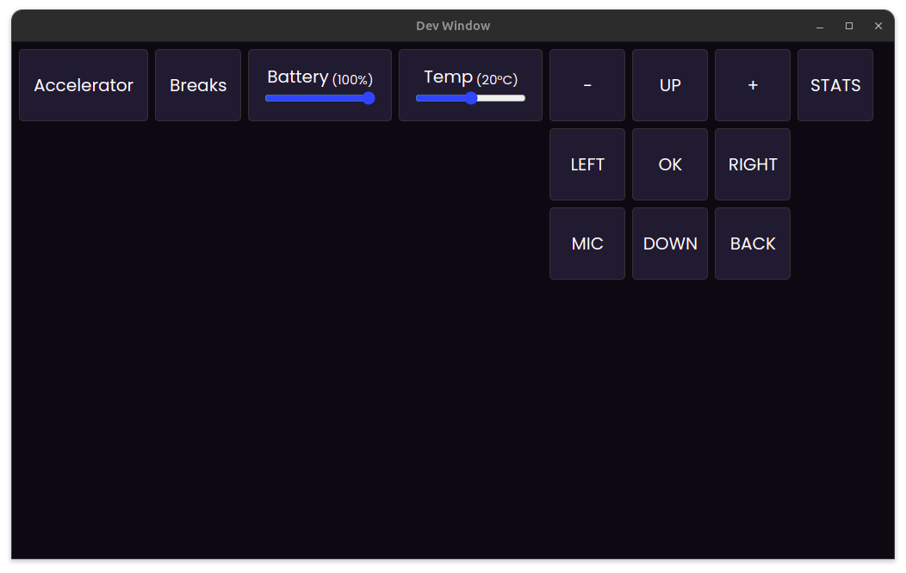

# Projet E-Motion

E-Motion est un projet ambitieux visant à concevoir un tableau de bord sur mesure, intégrant des technologies de pointe. Conçu pour offrir une expérience de conduite agréable et innovante, le tableau de bord E-Motion combine technologies de pointe, performances et design élégant.

## Objectif

L'objectif principal du projet E-Motion est de concevoir une expérience de conduite dynamique et sécurisée. Le tableau de bord sera équipé de technologies avancées pour améliorer la sécurité, la connectivité et le confort du conducteur et de ses passagers.

## Principales Caractéristiques

- **Services performants :** Le tableau de bord utilise des services performants et reconnus tel qu'Electron pour la création du logiciel, Waze pour les alertes utilisateurs, Mapbox pour un affichage dynamique et moderne de la carte, Spotify pour la diffusion de la musique et l'accès aux passagers à la playlist.

- **Écran 15" :** Actuellement, le logiciel est conçu pour un écran 15" tactile.

- **Système de Surveillance :** Des capteurs intégrés surveilleront en temps réel la conduite avec une dashcam intérieure et extérieurs ainsi qu'une caméra de recul.

- **Connectivité Avancée :** Le buggy sera équipé d'une connectivité Bluetooth et Internet pour la diffusion de musique (Spotify ou locale), les appels mains libres, et la communication avec d'autres appareils mobiles.

- **Accès CAN :** Le tableau de bord sera connecté au véhicule via la prise OBD-II (on-board diagnostic) permettant un accès en direct aux informations du véhicule tel que la vitesse, la capacité du réservoir, l'ouverture des portes...

## Composants Clés

Le projet E-Motion utilisera une variété de composants clés, notamment :

- **Jetson Nano :** Une carte informatique puissante, comme le Jetson Nano, servira comme ordinateur pour afficher le tableau de bord de façon fluide

- **Caméras et Capteurs :** Des caméras et des capteurs seront utilisés pour la détection des obstacles, la surveillance de l'environnement, et d'autres applications.

## Intérieur du Véhicule

En plus des fonctionnalités logicielles, l'intérieur du véhicule comprendra également :

- **Ports USB C :** Des ports USB C seront intégrés pour recharger les appareils électroniques, offrant une commodité supplémentaire pour les passagers.

- **Capteur de Distance à Ultrason :** Un capteur de distance à ultrason sera installé à l'arrière du véhicule pour détecter la distance par rapport aux obstacles lors de la marche arrière.

- **Connectivité Internet :** Une connectivité WiFi sera disponible pour fournir des informations tel que l'accès aux caméras lorsque le véhicule est stationné, la position du véhicule...

- **Amplificateur Stéréo :** Le Jetson Nano sera connecté à un amplificateur stéréo pour une expérience sonore de qualité dans le véhicule.

- **Micro de Qualité :** Un micro de qualité sera installé pour les appels téléphoniques mains libres et autres fonctions de communication.

### Caractéristiques du Dashboard :

- **Taille de l'écran** : 15 pouces
- **Résolution** : 1366x768 pixels
- **Frameworks Utilisé** : Electron JS, Waze, Spotify, Mapbox, Google TTS, Google Maps, Chart JS, Wit.AI...

### Fonctionnalités Principales :

1. **Intelligence Artificielle Vocale** : Une intelligence artificielle basée sur Wit.AI permet de faire facilement des recherche de lieu et contrôler la musique
2. **Affichage des Informations du Véhicule** : Le dashboard affiche en temps réel des informations vitales sur le véhicule, telles que la vitesse, la température du moteur, le niveau d'essence, etc.

3. **Contrôle et Gestion** : Il permet aux utilisateurs d'interagir un tas d'applications tel que Spotify, Youtube, Caméra...

4. **Navigation Intuitive** : L'interface utilisateur est conçue pour être conviviale et intuitive, offrant une navigation fluide.

### Aperçu :

### Mode test et développement :
Afin de tester les différents composants du véhicule, une interface est mise à disposition simulant la connexion avec les éléments de celui-ci permettant d'avoir un accès facile au débogage

### Dépendances :
L'application possède plusieurs dépendances dont `Node JS`, `libbluetooth-dev`, etc. Pour les installer, executez le fichier `./install.sh`.

### Exécution des tests

Des tests unitaires simples sont fournis avec **Jest** pour vérifier certaines fonctions d'utilitaires. Pour les lancer, exécutez `npm run test`

## License

Le projet E-Motion est sous licence Creative Commons (CC BY-NC-ND 4.0). En téléchargeant ce dépôt, vous acceptez les termes de cette licence pour tous les éléments du projet. Le projet peut être partagé et utilisé à des fins non commerciales, avec mention de l’auteur et sans modification. Pour plus d'informations sur cette licence, veuillez consulter le fichier `LICENSE` à la racine du dépôt.

## Conclusion

Le projet E-Motion vise à repousser les limites de la mobilité en créant une interface innovante et futuriste, équipé des dernières technologies et conçu pour répondre aux besoins des conducteurs modernes. Suivez notre progression alors que nous travaillons à réaliser notre vision d'un avenir plus propre, plus sécurisé et plus connecté pour la conduite.

## Soutenir le Projet

Le projet E-Motion est une initiative passionnée et indépendante visant à repousser les limites de la mobilité. Si vous appréciez ce projet et souhaitez contribuer à son développement, vous pouvez apporter un soutien financier.

Chaque contribution aide à financer les composants, le matériel et les améliorations nécessaires pour faire avancer E-Motion.

🔗 Faire un don : [paypal.me/HydixFR](https://paypal.me/HydixFR?country.x=FR&locale.x=fr_FR)

Merci pour votre soutien ! 💙🚀
